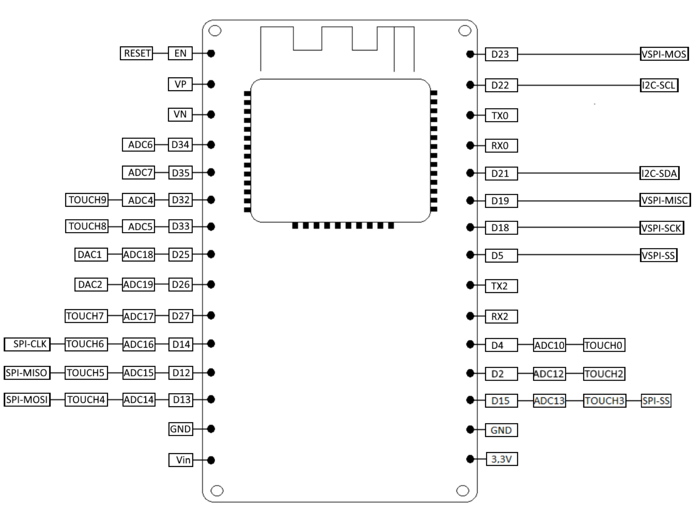
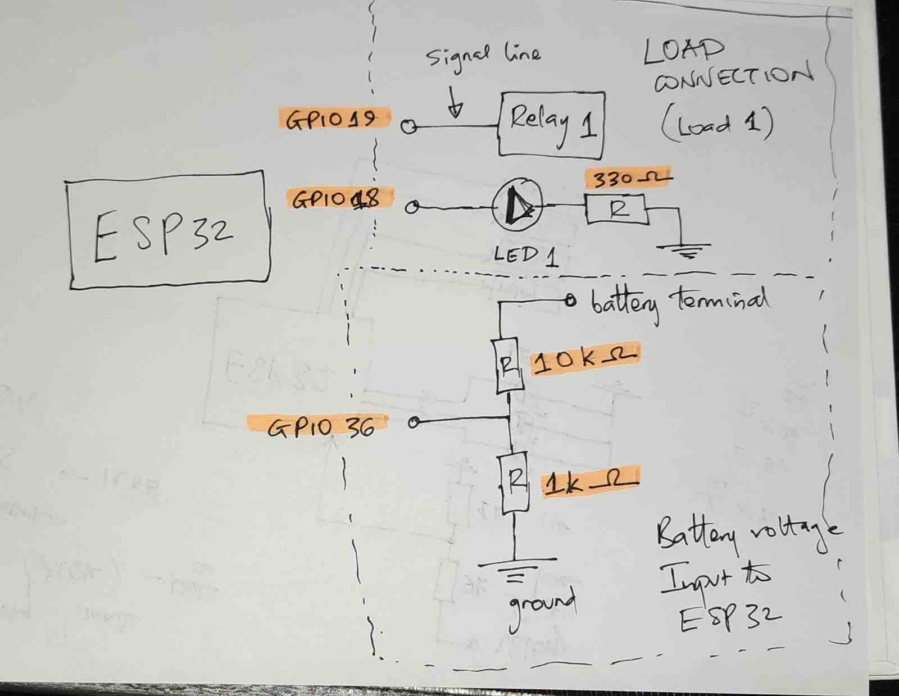
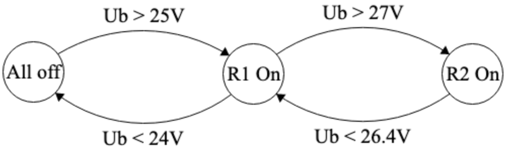
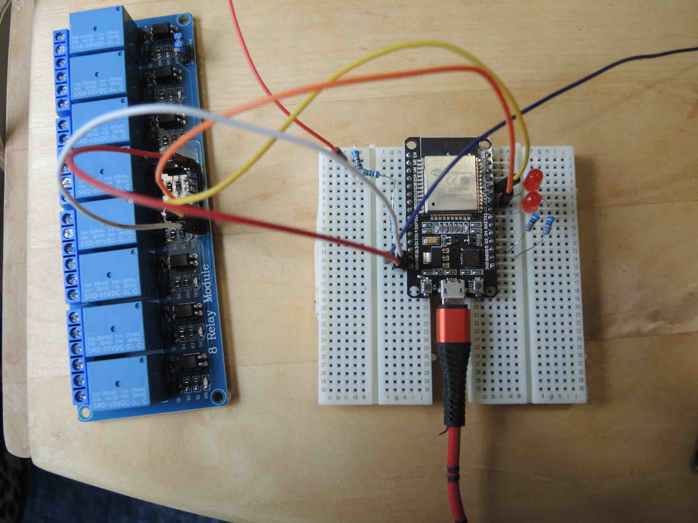
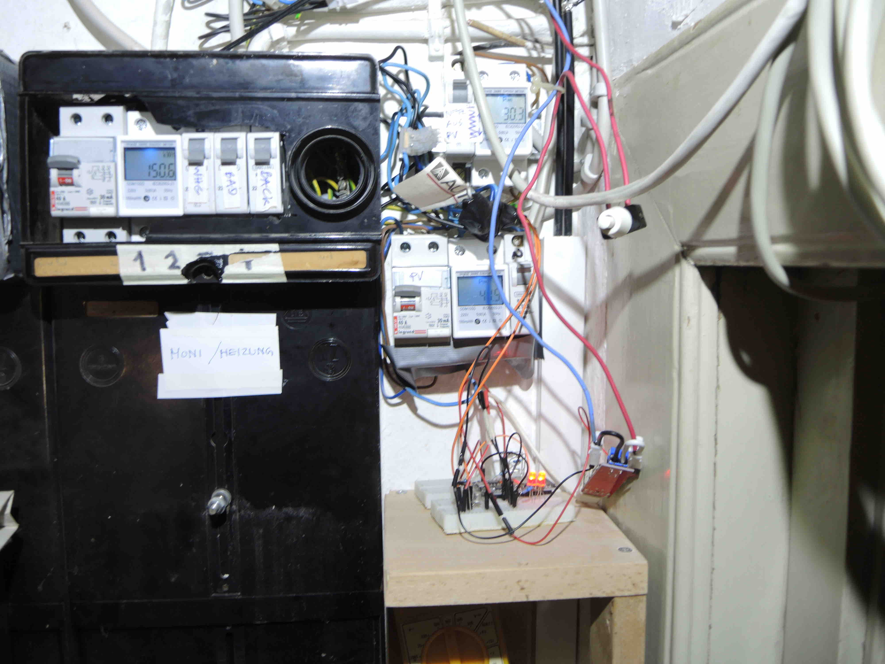
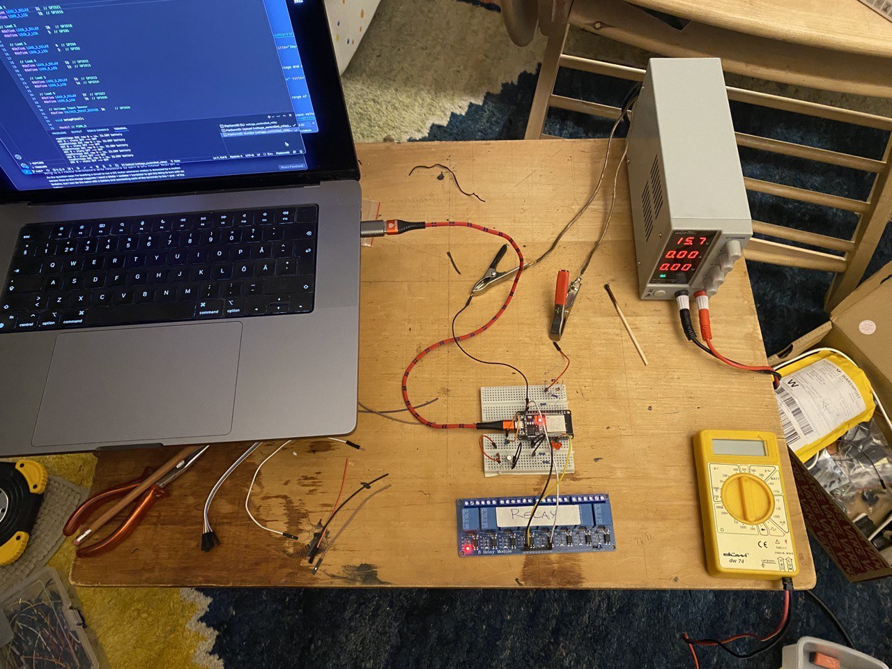
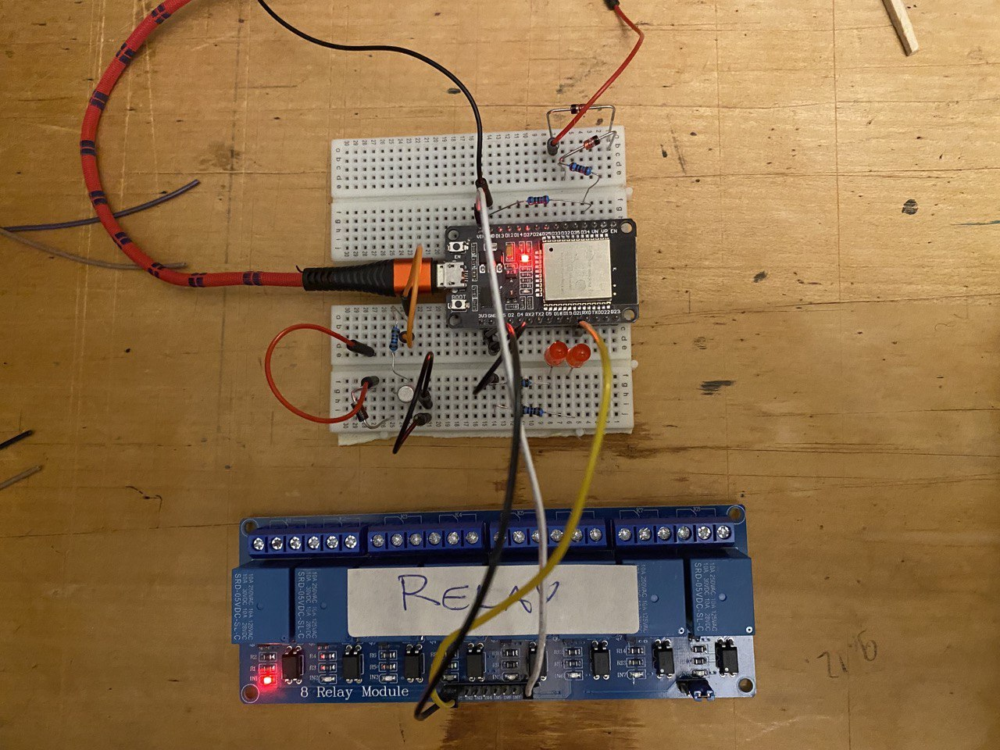
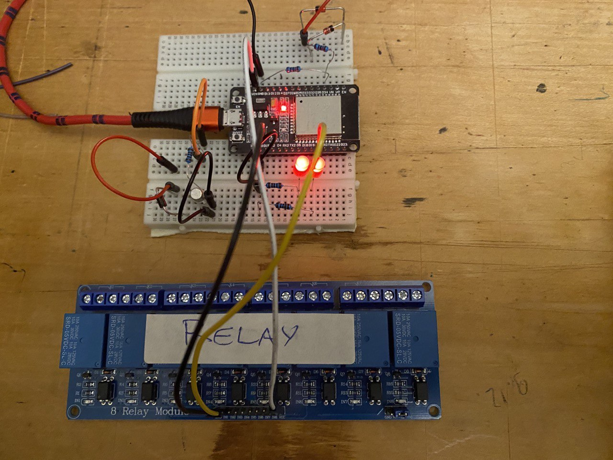
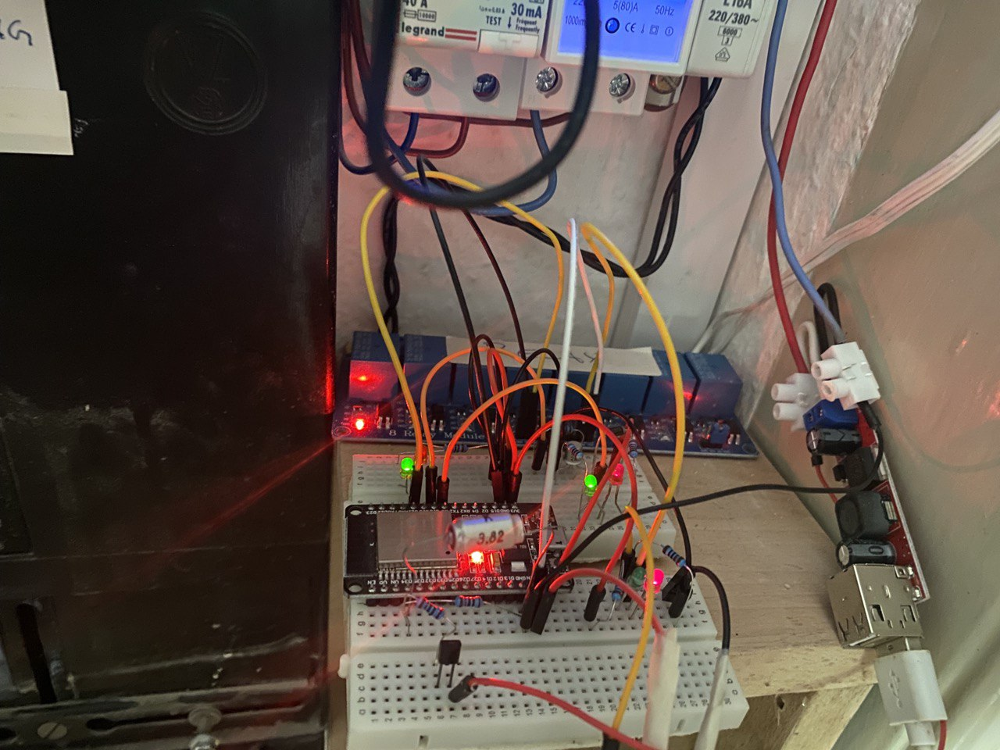
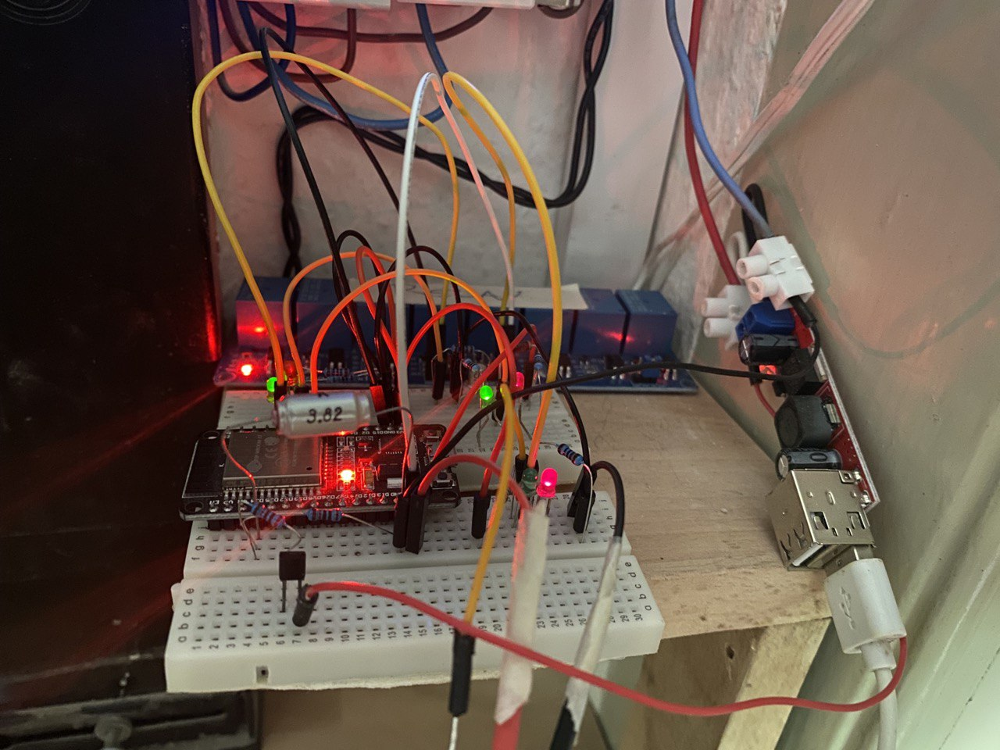

# Voltage Controlled Relay

The voltage controlled relay controls a bank of relays based on the voltage of a PV battery.
The input is the battery voltage in the range [24V,31V].
This is measured via a voltage divider to turn relays on and off when various thresholds are crossed:

- [Board](#board)
- [Schematic](#schematic)
- [Voltage divider with resistor](#voltage-divider-with-resistor)
- [Voltage shifter with Zener diode](voltage-shifter-with-zener-diode)
- [State machine](#state-machine)
- [Second approach](#second-approach)
- [Third approach with heat pump](#third-approach-with-heat-pump)

## Board

I am working with the [Joy-it NODEMCU ESP32 board](https://joy-it.net/en/products/SBC-NodeMCU-ESP32):

<center>
 <!-- 1788 x 1318 pixels -->
</center>

## Schematic

Here is the schematic to hook up the voltage divider measuring the 24V battery input voltage and control the relays and the LEDs showing their state:

<center>
 <!-- 1788 x 1318 pixels -->
</center>

## Power Supply

After various attempts, I discovered I have a JM14HS LM2576S module that takes an input range of [8V,36V] and produces a reliable 5V output to feed the ESP32.

## State Machine

In the first approach, we implemented a state machine to manage the relay states and transitions
(image generated using [Finite State Machine Designer](https://www.madebyevan.com/fsm/)):

<center>
 <!-- 1004 x 312 pixels -->
</center>

The transitions are complicated by the fact that each state, once attained, must be retained for a certain minimum amount of time before any state change can occur.
Or, to be more precise, the state transition does not happen until the trigger persists for a certain amount of time.
The trigger itself includes a minimum timespan to cause the state change.

We used [YA_FSM](https://github.com/cotestatnt/YA_FSM)
by [Tolentino Cotesta](https://www.hackster.io/tolentinocotesta),
described in [Let's learn how to use finite state machine with Arduino](https://www.hackster.io/tolentinocotesta/let-s-learn-how-to-use-finite-state-machine-with-arduino-c524ac),
since it includes functionality to support minimum and maximum timeouts for each state.
It is also equipped with a [wokwi simulation](https://wokwi.com/projects/338248486164103762).
It would be cool to set one up for this project as well.
That might save a lot of effort implementing real-world tests.

## Voltage Measurement

A surprising number of aspects and components come up to address this:

### Voltage Divider with Resistor

We need to convert the input battery voltage range [24V,31V] to fit into the ESP32 ADC input voltage range [0V,3.3V],
cf. [ESP32 ADC tutorial &ndash; read analog voltage in Arduino](https://deepbluembedded.com/esp32-adc-tutorial-read-analog-voltage-arduino/).
For simplicity, we implement a simple voltage divider using resistors.
Unfortunately, this means that the lower part of the range will never be used.
To determine the voltage divider resistors Ra + Rb resistance in Ohm:
Their resistance in parallel should come to ca. 10k,
cf. [What is the most efficient voltage divider for Arduino?](https://arduino.stackexchange.com/questions/78768/what-is-the-most-efficient-voltage-divider-for-arduino)
It should also be as high as possible to reduce the amount of current and thus the battery drain.
The [voltage divider calculator](https://ohmslawcalculator.com/voltage-divider-calculator) tells us that
30V converts to 3.289V using Ra = 81.2k = 75k + 6.2k and Rb = 10k, and the conversion forumlae back and forth are

- Vadc = Vbat * Rb/(Ra+Rb)
- Vbat = Vadc * (Ra+Rb)/Rb

The first test showed significant inaccuracy.
A better approach might be to pick two resistors for the voltage divider
that more or less fall into the correct range and then tweak the software
calculation values until the voltage reported by the Arduino matches the
real voltage applied externally.
With Ra = 82k and Rb = 10k, a constant `a2b` of ca. 0.00742 can be used to
map the ADC `int` range [0,4095] to the battery voltage range of ca. [0V,31V].

This voltage divider translates the voltage range [0V,33V] to the ADC `int` range [0,4095],
resulting in a resolution of ca. 0.8 mV per bit.

### Voltage Shifter with Zener Diode

Another [level shifting](https://itp.nyu.edu/physcomp/lessons/electronics/level-shifting/) option
uses Zener diodes to create a [voltage shifter](https://en.wikipedia.org/wiki/Zener_diode#Voltage_shifter).
I got two 12V 1.3W BZX85C12; they can be used to shift the range [24V,34V] down to [0V,10V].
That range can be transformed to [0V,5V] by a 1:2 resistor-based voltage divider.
The first test measurement indicates that the voltage across a 10k resistor preceded
by the two Zener diodes is reduced by ca. 23.2V, not 24V:

- [Voltage measurement results](doc/voltage_measurement.md)

Oh dear, I made a mistake: the ADC input range is [0V,3.3V], not [0V,5V].
Consequently, with the 1:2 10k + 10k resistor-based voltage divider, all voltages above ca. 29.3V generate an ADC output of 4095.
Luckily, contrary to some statements I've seen, the higher input voltage up to 4V or even 5V did not seem to do any harm.
And since I don't care about differences above 29V, and they hardly occur in my context, I think I'll leave the current voltage divider in place.

### Voltage Smoothing with a Capacitor

The ADC measurements were jumping up and down pretty erratically.
I added a 22 uF capacitor between the ADC input sensor pin GPIO34 and ground and the problem went away.
However, it may be much too big and thus deteriorate the reaction time.
I need the switch to be fast so that the heat pump can continue working uninterrupted when it is switched from one power source to the other.
Using a [capacitor discharge calculator](https://www.redcrab-software.com/en/Calculator/Electrics/C-discharge-state),
I see that 47 nF may be more appropriate, yielding a dischange time of a couple of ms across 10 kOhm.

I returned to the RC low pass filter approach after trying the software-based median smoothing for several days with moderate success.
[Using capacitors to filter out unwanted electrical noise](https://www.arrow.com/en/research-and-events/articles/using-capacitors-to-filter-electrical-noise)
with a [passive low pass filter](https://www.electronics-tutorials.ws/filter/filter_2.html), the cut-off frequency f is given by

&nbsp; f = 1 / 2&pi;RC

Say we would like a cut-off frequency of 20 Hz to remove influences both from very short bursts of noise as well as the hum from 50 Hz grid mains, and given that R is fixed at ca. 10 kOhm by the ADC requirements, a suitable capacitor would have about

&nbsp; C = 1 / (20 &middot; 2&pi; &middot; 10k) = 1/1257120 = 8e-7 = 0.8 uF

### Software Voltage Smoothing

First thought was to implement voltage smoothing using a running average.
However, to remove noise effects from the measurement, an approach using the median is more appropriate,
cf. [the difference between median and average](https://sciencenotes.org/median-vs-average-know-the-difference-between-them/).
I tried different values for the median smoothing and achieved improvements using a larger median window, e.g., 401 measurement values taken with a 3 ms loop delay.
However, I still experience frequent spurious switching off, so I moved back to the voltage smoothing with a capacitor again.
I note that the INA226 enables setting of 1, 4, 16, 64, 128, 256, 512, or 1024 individual measurements for averaging, and an A/D conversion time between 140 µs and 8.244 ms.
So, maybe I should use something similar to the maximum settings available there, e.g. a median window of 1001 and a loop delay of 8.


## Relay Driver

A relay module consumes ca. 5 mA and can be driven straight from the GPIO pin.
A naked relay, however, consumes too much current and requires a driver.

### Driving Relay Module and Two LEDs From Same Pin

The initial design uses separate GPIO pins to control the relay and the led displaying its state.
Wouldn't it be equally possible and a little bit more efficient to attach both relay and led to the same output?
Answer: [How much current can I draw from the Arduino's pins?](https://electronics.stackexchange.com/questions/67092/how-much-current-can-i-draw-from-the-arduinos-pins)
&ndash; max 40 mA per pin and max total from all pins 200 mA;
ditto for the [ESP32 current limits](https://www.esp32.com/viewtopic.php?t=5840).
The led consumes about 10 mA, and the relay module probably sucks about 5 mA,
cf. [how does the Arduino 5VDC relay module work?](https://electronics.stackexchange.com/questions/622826/how-does-the-arduino-5vdc-relay-module-work-using-srd-05vdc-sl-c)

To take this one step further, I attached two LEDs, one red and one green,
so that both the OFF and ON states are highlighted visually,
using the very simple approach described
in [figure 5](https://electronics.stackexchange.com/a/342185) in the answer
to [controlling two LEDs with one digital output](https://electronics.stackexchange.com/questions/342178/controlling-two-leds-with-one-digital-output)

### Relay Driver Transistor Switch

[Driving a relay directly](https://maker.pro/arduino/projects/driving-a-relay-with-an-arduino) is
different from driving a relay module.
I use a 2N2222 NPN transistor, a 1N4007 diode, 1k resistor from the ESP32 output pin to the 2N2222 base:

- [Schematic](/img/2023-05-26_relay_driver.jpg)
- [Circuit board](/img/2023-05-26_relay_driver_schematic.png)

### Timer Take Two

- [Using `millis` for timing. A beginners guide](https://forum.arduino.cc/t/using-millis-for-timing-a-beginners-guide/483573)
- [Demonstration code for several things at the same time](https://forum.arduino.cc/t/demonstration-code-for-several-things-at-the-same-time/217158)


## Second approach

Rewrote the switch using a very simple state machine implemented manually with no librasry and no timer settings.
Just switch states immediately on crossing the following thresholds for the battery voltage Ub:

- Start == OFF:
    - Ub > 25.5V &rarr; R1_ON
- R1_ON:
    - Ub < 24.9V &rarr; OFF
    - Ub > 27V &rarr; R1_AND_R2_ON
- R1_AND_R2_ON:
    - Ub < 24.9V &rarr; OFF
    - Ub < 26.5V &rarr; R1_ON

I simplified the code by implementing the state machine in a more minimal fashion and eliminating all timing considerations.
Check out simplified algorithm in [main.cpp](src/main.cpp).
I built and successfully tested the new approach that according to the schematic above with two relays connected, which is all I will need in real life:

<center>
 <!-- 1004 x 312 pixels -->
</center>

It works perfectly, afaict, except that the voltage measurement is imprecise.
In the lower region, under 25V, the ADC conversion reports a too low voltage, and in the high region it is too high.
Also, I am afraid of breaking the ADC by inadvertently applying a too high input voltage, since I am just twiddling a knob by hand to control it.

I'll see whether I can fine-tune it better somehow.
For instance, I could implement a custom mapping of the ADC ranges to the corresponding real-world voltage aapplied.
I think I would like to install this soon for real-world testing and use.

## Third Approach with Heat Pump

The [hot water heat pump](https://waldrain.github.io/moniwonig#wwwp) is up and running.
It needs to run at least three hours and consume 1.5 kWh per day.
It also needs to run uninterrupted for as long as possible, at least an hour at a time, preferably two or three in a go.
Also, to ensure enough hot water is available if the sun does not shine enough during one day,
it must be able to run on grid mains power after sunset to fulfil the daily requirement.
Since the PV system and the grid mains use separate electrical residual current circuit breakers, FI-Schutzschalter,
both the phase and the neutral lines need to be switched when switching between PV and grid mains, requiring two separate relays.
The two relays can both be controlled by one single pin, though.
So, we have the following relays to switch:

- R1 &ndash; general PV power
- R2n + R2p &ndash; PV power for the heat pump
- R3n + R3p &ndash; grid mains power for the heat pump

The three relays have four states:

- OFF
- R1_ON
- R1_AND_R2_ON
- R3_ON

The relays and the heat pump time counter T can be controlled using the following state machine that needs to be restarted every day:

- Start:
    - &rarr; OFF
OFF:
    - T = 0
    - Ub > 25.5V &rarr; R1_ON
- R1_ON:
    - Ub < 24.9V &rarr; OFF
    - Ub > 26.8V &rarr; R1_AND_R2_ON, Tstart = current_time
- R1_AND_R2_ON:
    - Ub < 24.9V &rarr; OFF, T += current_time - Tstart
    - Ub < 26.5V &rarr; R1_ON, T += current_time - Tstart
- current_time > sunset:
    - if T < 3_hours &rarr; R3_ON, Tend = current_time + max( 1_hour, 3_hours - T )
    - if current_time > Tend &rarr; OFF

I introduced Tend and added the call to max to ensure that the heat pump is not switched on for too short time.

## Fourth Approach with DPDT and Timer

Ulrich suggests more rigorously ensuring the separation of the grid mains and PV electrical circuits using a DPDT relay controlled by the Arduino.
Furthermore, the grid mains can go through a programmable timer outlet switch before reaching the relay.
Then, the Arduino can run the heat pump on PV as long as possible, keep track of the running time per day, and switch the relay to grid mains for the remaining duration.
The timer can be added to ensure that the heat pump does not run around the clock if the arduino fails.
Ulrich also mentioned using [TinkerCAD](https://www.tinkercad.com/) for both electronic schematics and
3D printing projects, ald also [fritzing.org](https://fritzing.org/).

## System Time

The ESP32 supports [system time](https://docs.espressif.com/projects/esp-idf/en/latest/esp32/api-reference/system/system_time.html).
Set it using `settimeofday`, cf. [test code](https://github.com/espressif/esp-idf/blob/9a55b42f0841b3d38a61089b1dda4bf28135decd/components/fatfs/test/test_fatfs_common.c#L218-L228).

## Live Test 1 2023-05-26

We leave the house for a while in June.
During our absence, I want the hot water heat pump (wwwp) to run on PV as much as possible.
Hence, a rather hurried final first implementation and live test before leaving.
I eliminate R1 and just left R2 implemented using the DPDT relay with the relay driver transistor switch described above:

<table>
  <tr>
    <td></td>
    <td></td>
    <td></td>
  </tr>
</table>

Important aspect: when the Arduino is turned off, the relay remains in the low voltage default state, which is grid mains.
The voltage measurement uses the two 12V Zener diodes plus 1:2 voltage divieder.
The trigger voltages are manually defined in approximate ADC units:

```
int adcTurnOffAll = 1200; // 25.2V
int adcTurnOnR1 = 1500; // 26.0V
int adcTurnOffR2 = 1950; // 26.5V
int adcTurnOnR2 = 2350; // 27.0V
```

The wwwp is fed directly by PV when the relay is on, i.e., over the R2 trigger voltages, or else by grid mains.
We use the internal wwwp clock to limit its operation to four hours from 12:00 noon until 16:00 every day, and set its target water temperature to 48&#176;C.
According to our [measurements so far](https://waldrain.github.io/moniwonig#wwwp), that ought ot suffice.

On second thoughts, a better approach would be to only implement R1 instead of R2 and connect the wwwp to the moniwonig standard mains.
That runs on PV by default and includes an automatic switch to grid mains when no AC electricity is provided by the inverter.
Currently, this state is only reached when the battery is completely empty and the entire PV system breaks down.
However, using R1 to remove the load from the inverter below a battery threshold voltage of ca. 25.5V would prevent the breakdown, gracefully switch to grid mains and all would be fine.

Later: it did not work out.
Why is unclear.
Testing the circuit manually in July, everything still works as expected.
Joerg had to switch the wwwp to grid mains and limit its consumption by lowering the target temperature to 47 degrees and specifying two three-hour time slots to run in, 0-3 and 12-15 o'clock.
Then, the consumption was acceptable.
Now, in July, turning it on and off manually, I reach 65 degrees hot water every day using PV only.

## Live Test 2 2023-07-15

This time around, I just want to use the voltage controlled switch as an emergency cut-off to remove all loads from the PV inverter if the DC voltege is too low, e.g., below 25.1V.
I lowered the `adcTurnOffAll` threshold to 1000 ADC units and left the others as above.
I increased the LED series resistors from 330 ohm to 1 kohm to reduce the light intensity and current used.

<table>
  <tr>
    <td></td>
    <td></td>
    <td></td>
    <td></td>
  </tr>
</table>

## Live Test 2 2023-07-18

During the installation three days ago, I touched one of the Zener diodes and burnt it out.
Replaced them both with a single 24V Zener diode, adjusted the `readVolt` parameters for a more accurate voltage report, and lowered the ADC thresholds accordingly.
Right now, the only function is the emergency cut-off.
The advantage is that if the PV power is cut off, the other switch box automatically toggles the entire supply to grid mains, including the WWWP.

## Fifth Approach 2023-08-17

Requirements have evolved. Currently, they are:

- `pv` controls a relay R1 that removes all loads from the PV system if the battery is low, e.g., below 25.0V; default to `OFF`
- `hp` controls a DPDT relay R2 toggling the heat pump power source between PV and grid mains; use PV if the battery voltage of above 25.9V; default to grid mains
- `hppv` controls relay R3, connected to the heat pump PV switch that turns on the heat pump if the PV voltage is high, say above 27V; default to `OFF`

Ensure that all the relays are connected so that the Arduino `OFF` state corresponds to `NO_POWER`.
R1 and R3 reside on a relay module bank and can be controlled directly with thr GPIO pins.
However, the bank requires me to invert the GPIO output states for R1 and R3 to achieve `OFF` == `NO_POWER`.
R2 is controlled via a relay driver transistor switch.

For some reason, the `hp` R2 relay switch started switching back and forth very rapidly, making a buzzing sound, so I removed it and temporarily hardwired the heat pump to PV power.
Here is the installation after that removal:

<table>
  <tr>
    <td></td>
    <td></td>
  </tr>
</table>

Maybe more smoothing is needed for measuring the battery voltage?
Maybe I should use a running average rather than a capacitor, so I would have software control over it and could log the min and max values coming in to see what is going on.

## Authors

[Allan Kipkirui Koech](https://github.com/allankkoech) in Nairobi,
Ulrich from Loerrach
and Jeremy Tammik,
[The Building Coder](http://thebuildingcoder.typepad.com),
[Autodesk Platform Services APS](http://aps.autodesk.com),
[ADN](http://www.autodesk.com/adn)
[Open](http://www.autodesk.com/adnopen),
[Autodesk Inc.](http://www.autodesk.com)

## License

This sample is licensed under the terms of the [MIT License](http://opensource.org/licenses/MIT).
Please see the [LICENSE](LICENSE) file for full details.
